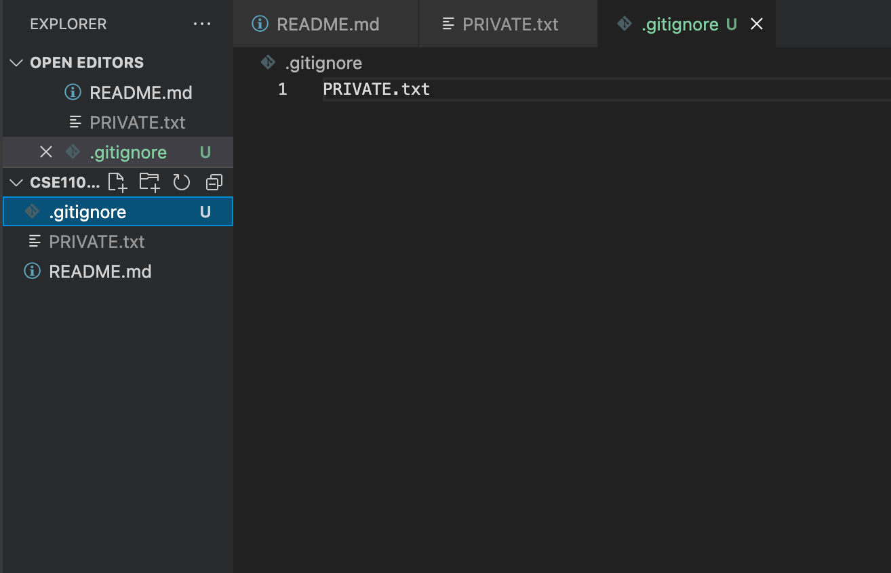

# Documentary

Click [thislink] (#Who-am-I) to go to Who am I section.

## Pictures
**Command Line Images**


**VSCode Images**



## Who am I
Hello guys, my name is Nathaniel Susabda.
> I am currently a senior at UCSD. As a programmer, I personally prefer to be a FrontEnd Enginner because i like to design things. Also, I hope that by taking this course I can get some industry experience on coding. Some fun facts about me is that i really love to play badminton. Feel free to contact me so we can play together!

What I love to do on my free time:
- Play badminton
- Watch movies
- Hangout with friends

## Some git commands for this assignment
```
git branch
git commit
git add
```

## Useful websites for this assignment
Useful Links:
1. [FirstLink] (https://docs.github.com/en/get-started/writing-on-github/getting-started-with-writing-and-formatting-on-github/basic-writing-and-formatting-syntax#lists)
2. [SecondLink] (https://code.visualstudio.com/docs/sourcecontrol/overview#_git-support)

## List of Tasks for this assignment
- [x] Create a github repository
- [x] Clone your repository
- [x] Add some files
- [x] Stage and commit


